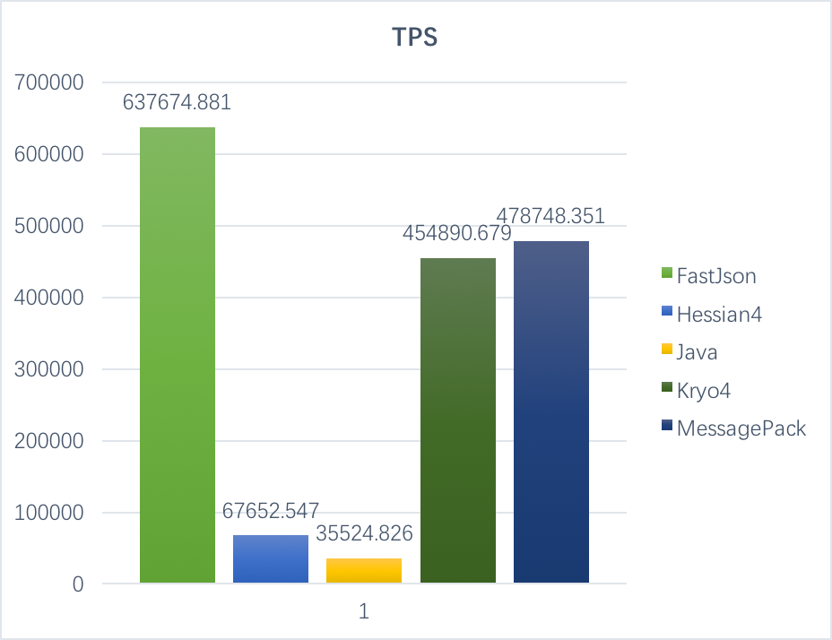
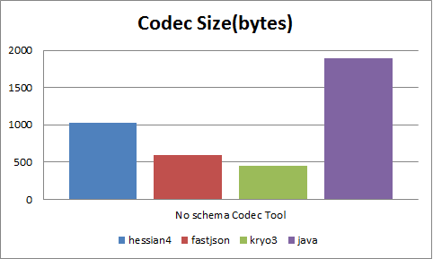

jvm-serializer
==============
### Description
#### This project is a function and performance benchmark test for kyro4,fastjson,hessian and messagePack codec (Serialize and Deserialize).which are most popular non-schema Serialize and Deserialize tools nowadays. 
### Environment
#### Hardware: 
#####  Intel(R) Core(TM) i7 CPU @ 2.2GHz,8 core 16G memory
#### Software:
##### Darwin Kernel Version 15.4.0: Fri Feb 26 22:08:05 PST 2016; root:xnu-3248.40.184~3/RELEASE_X86_64 x86_64
##### Java HotSpot(TM) 64-Bit Server VM (build 25.77-b03, mixed mode)

### Test case
#### 1.Using JMH,After 10 seconds warmup iterations, do 10 times measurement iterations, each iteration costs 5 seconds.
#### 2.Consider some special java type,such as BitEnum,EnumSet etc...
#### Report

##### If you have any good advice,please contact fengjia10@gmail.com or zhou@xinyu.im

